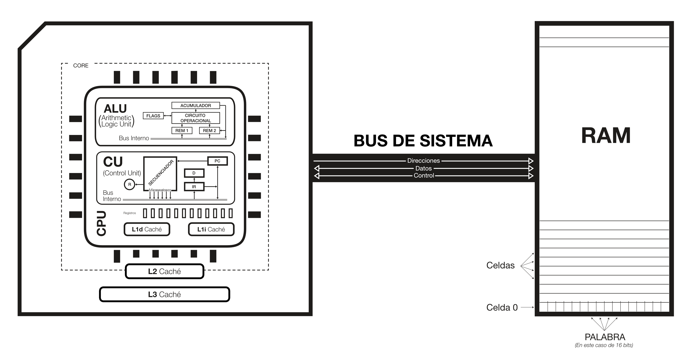

## 1) ¿En qué consiste la arquitectura de Von Neumann?

Imagina que un ordenador es, en esencia, una máquina que **recuerda** y **actúa**. Recuerda en una gran biblioteca —la memoria— y actúa con un pequeño taller —la CPU— que toma instrucciones, las interpreta y realiza operaciones. La arquitectura de Von Neumann es la forma clásica de contar esta historia, y su idea más brillante es sorprendentemente sencilla: **en la misma memoria se guardan tanto los datos como las instrucciones**. No hay una “estantería” para los números y otra para las órdenes: todo es información escrita con el mismo alfabeto de bits.

### El momento en que el programa dejó de ser un cable

En 1945, John von Neumann redactó un texto célebre, **“First Draft of a Report on the EDVAC”**. Ahí se describe con claridad un principio que cambió la computación: si las instrucciones pueden almacenarse como datos, entonces **cambiar de tarea no exige reconstruir la máquina**, basta con cambiar lo que hay en memoria. Es como si, en lugar de fabricar un instrumento nuevo para cada melodía, pudiéramos tocar muchas melodías distintas con el mismo instrumento… simplemente cambiando la partitura.

> **Fuente institucional con DOI**
> 
> Von Neumann, J. (1945). *First draft of a report on the EDVAC*. Moore School of Electrical Engineering, University of Pennsylvania. [https://doi.org/10.5479/sil.538961.39088011475779](https://doi.org/10.5479/sil.538961.39088011475779)
>
> **PDF directo alojado por MIT**
> 
> Von Neumann, J. (1945). *First draft of a report on the EDVAC* [Report]. [https://web.mit.edu/sts.035/www/PDFs/edvac.pdf](https://web.mit.edu/sts.035/www/PDFs/edvac.pdf) 

### Las tres piezas del relato (y por qué encajan)

En el esquema “de manual” aparecen tres protagonistas:

* **La CPU**, el taller donde ocurren las decisiones y las operaciones.
* **La memoria principal (RAM)**, la biblioteca que almacena *programas y datos*.
* **El bus del sistema**, la carretera por la que viajan direcciones, datos y señales de control entre CPU y memoria.

Y con esas tres piezas, la máquina hace algo casi hipnótico por su repetición: busca una instrucción en memoria, la entiende y la ejecuta… y vuelve a buscar la siguiente. Ese ritmo —*buscar, interpretar, ejecutar*— es el latido de la arquitectura Von Neumann.

## 2) Componentes del computador

Un ordenador, visto desde lejos, es un pequeño ecosistema con tres grandes habitantes: **la CPU**, **la memoria** y los **dispositivos de entrada/salida**. Entre ellos hay “carreteras” que transportan información. En la arquitectura de Von Neumann, lo importante no es tanto la forma exacta del hardware moderno, sino la **función** que cumple cada pieza y cómo cooperan.

### CPU: el taller donde se ejecuta el programa

La **CPU** es el lugar donde ocurre la acción. Su misión es **interpretar instrucciones** y **realizar operaciones** con los datos. Dentro de la CPU viven dos ideas fundamentales:

* **Unidad de Control (CU)**: decide *qué toca hacer ahora* y coordina el resto.
* **Unidad Aritmético-Lógica (ALU)**: hace las operaciones (sumas, comparaciones, AND/OR, desplazamientos…).

Además, la CPU se apoya en **registros**, que son como una mesa de trabajo muy rápida: guardan temporalmente valores e información de estado mientras se ejecuta el programa (los veremos con detalle en el punto 3).

### Memoria principal: la biblioteca compartida

La **memoria principal (RAM)** es donde el ordenador guarda **el programa y los datos** mientras se está ejecutando. En Von Neumann, esta idea es crucial: **instrucciones y datos conviven** en el mismo espacio de memoria. La CPU va a esa memoria para traer la próxima instrucción, leer operandos o escribir resultados.

### Entrada/Salida: los sentidos y la voz del sistema

Los dispositivos de **E/S** son la forma que tiene el ordenador de relacionarse con el exterior:

* **Entrada**: teclado, ratón, sensores, red…
* **Salida**: pantalla, impresora, audio…
* **Almacenamiento** (a menudo se trata como E/S): SSD, disco, USB…

En la práctica, la CPU no está “hablando” constantemente con cada dispositivo: suele hacerlo a través de controladores y mecanismos como interrupciones o DMA (los mencionarás al final, cuando el bus de control tenga protagonismo).

### La interconexión: cómo “se hablan” las piezas

Para que todo esto funcione, hace falta un sistema de comunicación. En esquemas de oposición se suele representar como un **bus del sistema** (o varios buses) que transportan:

* **direcciones** (a qué posición de memoria o dispositivo se quiere acceder),
* **datos** (lo que se lee o se escribe),
* y **control** (leer, escribir, esperar, interrumpir…).

Más adelante lo convertiremos en algo concreto: qué significa cada bus y por qué no todos “van en los dos sentidos”.

## 3) CPU: ALU, CU y registros

Si la memoria es una biblioteca, la **CPU** es el lugar donde el libro se “lee” y se convierte en acciones. Dentro de la CPU hay dos grandes protagonistas —**CU** y **ALU**— y un conjunto de herramientas rápidas que permiten trabajar sin tener que ir a memoria a cada instante: **los registros**.

### Unidad de Control (CU): el director de orquesta

La **Unidad de Control** se encarga de que todo ocurra en el orden correcto. Su trabajo no es “calcular”, sino **coordinar**:

* decide qué instrucción toca ejecutar,
* activa las señales necesarias para leer de memoria o escribir en ella,
* selecciona qué registros participan,
* y ordena a la ALU qué operación debe realizar.

En términos de examen: la CU gobierna el ciclo *buscar–decodificar–ejecutar* y sincroniza el funcionamiento interno.

### Unidad Aritmético-Lógica (ALU): el taller de operaciones

La **ALU** es la parte que realiza operaciones sobre los datos. Su nombre ya lo sugiere:

* **Aritméticas**: suma, resta, (a veces multiplicación/división, según el diseño).
* **Lógicas**: AND, OR, XOR, NOT.
* **Desplazamientos y rotaciones**: muy usados para multiplicar/dividir por potencias de dos y para manipulación de bits.
* **Comparaciones**: que, en la práctica, suelen traducirse en “hacer una operación y mirar banderas”.

La ALU trabaja con operandos que suelen venir de **registros** y deja el resultado en otro registro.

### Registros: la mesa de trabajo rápida

Los **registros** son pequeñas memorias *muy rápidas* dentro de la CPU. Su función es reducir viajes a la RAM y permitir que la ejecución sea ágil. En oposiciones se suele hablar de dos grandes grupos:

#### a) Registros de propósito general (GPR)

Son los registros “normales” donde se guardan temporalmente datos y direcciones mientras se ejecutan instrucciones. Según la arquitectura pueden tener nombres concretos (R0, R1…, EAX…, X0…), pero la idea común es que sirven para **operandos y resultados**.

#### b) Registros especiales (imprescindibles para entender la ejecución)

Aquí aparecen dos que conviene tener localizados desde ya, aunque los detallarás en la CU más adelante:

* **PC (Program Counter / Contador de programa)**: contiene la dirección de la **siguiente instrucción** a ejecutar. Es la brújula del programa.
* **FLAGS / PSW (registro de banderas o de estado)**: guarda señales como *cero*, *acarreo*, *signo*, *overflow*, etc. Son claves para decisiones del tipo “si el resultado es cero, salta”.

> En este punto basta con saber qué son y para qué sirven. En el apartado de la CU veremos cómo PC e IR se usan para traer y decodificar instrucciones, y cómo las FLAGS se actualizan tras operar en la ALU.

## 4) El bus del sistema

Hasta ahora hemos descrito “quién hace qué”. Falta lo más cotidiano: **cómo se comunican** la CPU y la memoria. Ese papel lo cumple el **bus del sistema**, que puede imaginarse como un conjunto de líneas compartidas por las que viaja la información. En los esquemas de oposición suele dividirse en tres buses, porque cada uno transporta un tipo de información distinto.

### Bus de direcciones (CPU → memoria)

El **bus de direcciones** indica *dónde* se quiere acceder: qué posición de memoria (o qué dispositivo) está implicada.

Se representa normalmente **unidireccional (CPU → RAM)** porque, en un acceso típico, la **CPU es quien coloca la dirección** que desea leer o escribir. La memoria no “inventa” una dirección; responde a la que recibe.

* Ejemplo mental: “Quiero leer lo que hay en la dirección 0x1000”.
* La CPU pone `0x1000` en el bus de direcciones.

### Bus de datos (CPU ↔ memoria)

El **bus de datos** transporta *el contenido*.

Se representa **bidireccional** porque depende de la operación:

* **Lectura (READ)**: los datos van **memoria → CPU**.
* **Escritura (WRITE)**: los datos van **CPU → memoria**.

Si lo piensas como un envío de paquetes, el bus de direcciones dice “a qué buzón”, y el bus de datos lleva “lo que metes o sacas del buzón”.

### Bus de control (CPU ↔ memoria)

El **bus de control** lleva las señales que convierten todo lo anterior en una acción concreta. Aquí viajan órdenes y respuestas del tipo:

* **CPU → memoria**: “leer”, “escribir”, “esta dirección es válida”, “selecciona este dispositivo…”
* **memoria → CPU**: “listo”, “espera”, “hubo un error…”, e incluso señales como **interrupciones** (según el esquema que se adopte).

Por eso suele dibujarse también **bidireccional**: hay señales de ida y señales de vuelta.

### ¿Qué pasa en un acceso típico a memoria?

En un acceso “de manual” la secuencia conceptual es:

1. La CPU pone una **dirección** en el bus de direcciones.
2. La CPU activa en el bus de control la señal de **READ** o **WRITE**.
3. Si es READ, la memoria coloca el **dato** en el bus de datos.
   Si es WRITE, la CPU coloca el **dato** en el bus de datos.
4. La memoria confirma (por control) que la operación terminó.

No es necesario entrar aquí en temporización real o ciclos; lo importante es que el bus **separa roles**: dirección, datos y control.

## 5) Ciclo de instrucción: Fetch–Decode–Execute

La arquitectura de Von Neumann cobra vida cuando la CPU entra en su rutina más característica: **buscar una instrucción, entenderla y ejecutarla**. Ese bucle se repite millones (o miles de millones) de veces por segundo y explica por qué el ordenador puede hacer tareas complejas a partir de pasos muy simples.

Para seguirlo, basta con tener presentes tres ideas:

* **El programa está en memoria** (junto con los datos).
* La CPU necesita saber **qué instrucción toca**: ahí entra el **PC**.
* La instrucción que se está procesando se guarda en un registro: el **IR** (lo detallaremos en la CU).

### 1) Fetch (búsqueda de la instrucción)

En la fase *fetch*, la CPU va a memoria a por la siguiente instrucción.

Conceptualmente ocurre esto:

1. El **PC** contiene la dirección de la próxima instrucción.
2. Esa dirección se coloca en el **bus de direcciones**.
3. La CU activa en el **bus de control** una señal de **lectura (READ)**.
4. La memoria devuelve la instrucción por el **bus de datos**.
5. La CPU la carga en el **IR**.
6. El **PC se actualiza** para apuntar a la siguiente instrucción (normalmente PC = PC + tamaño de instrucción, salvo saltos).

### 2) Decode (decodificación)

En *decode*, la CPU interpreta qué significa esa instrucción:

* El **decodificador** (en la CU) reconoce el *opcode* (la “acción”: sumar, cargar, saltar…).
* Determina qué **operandos** necesita (registros, direcciones de memoria, inmediatos…).
* Prepara las señales internas para ejecutarla: qué registros leer, qué operación hará la ALU, si habrá acceso a memoria, etc.

Aquí no se “calcula” aún; aquí se **planifica** la ejecución.

### 3) Execute (ejecución)

En *execute* ocurre la acción:

* Si la instrucción es aritmética o lógica, la **ALU** opera con valores (normalmente tomados de registros) y deja el resultado en un registro.
* Si la instrucción implica memoria (por ejemplo, cargar o guardar), se realiza un acceso usando buses: dirección, control y datos.
* Si la instrucción es un salto, se modifica el **PC** para que apunte a otra parte del programa.
* Tras muchas operaciones, se actualizan las **FLAGS** (banderas) según el resultado: cero, acarreo, signo, overflow, etc.

**CLAVE:** Este ciclo no es solo “una explicación bonita”: es el mecanismo que justifica por qué existen PC, IR, decodificador, bus de control y banderas. Si entiendes *fetch–decode–execute*, entiendes la película completa.

## 6) La Unidad de Control en detalle

La **Unidad de Control (CU)** es el “centro de mando” de la CPU. No se dedica a calcular; su función es **organizar la ejecución**: traer instrucciones desde memoria, interpretarlas y generar las señales internas que mueven datos entre registros, memoria y la ALU.

Para entenderla bien (y para oposiciones), conviene verla como un conjunto de piezas que convierten *una instrucción almacenada* en *una secuencia de acciones internas*.

### PC (Program Counter / Contador de Programa)

El **PC** guarda la dirección de la **siguiente instrucción** que debe ejecutarse. Es lo que permite que el programa avance de forma ordenada.

* En ejecución normal, el PC se actualiza para ir a la instrucción siguiente.
* En saltos, llamadas y retornos, el PC cambia para apuntar a otra dirección.

### IR (Instruction Register / Registro de Instrucción)

Cuando la CPU realiza la fase de *fetch*, la instrucción leída desde memoria se carga en el **IR**. A partir de ese momento, la CU puede “mirar” esa instrucción sin depender continuamente del bus de memoria.

### Decodificador

El **decodificador** interpreta el contenido del IR:

* identifica el **opcode** (qué operación se solicita),
* y extrae la información necesaria sobre **operandos** (registros, inmediato, dirección, etc.).

Su salida no es un número “para el usuario”, sino señales internas del tipo: “lee estos registros”, “usa la ALU en modo suma”, “hay que escribir resultado”, “accede a memoria”, etc.

### Secuenciador

Muchas instrucciones se ejecutan internamente en **varios pasos**: mover operandos, activar la ALU, guardar el resultado, actualizar banderas…

El **secuenciador** decide el **orden** de esos pasos y cuándo se activan las señales correspondientes. En algunos temarios se expresa diciendo que la CU genera una secuencia de **microoperaciones** (acciones elementales dentro de la CPU).

### Reloj (clock)

El **reloj** marca el ritmo de la CPU. Su papel es sincronizar:

* cuándo se consideran válidos los datos,
* cuándo se capturan en registros,
* y cuándo se avanza de un paso interno al siguiente.

No aporta “inteligencia”, pero sí hace posible que todo el sistema funcione de forma coordinada y repetible.

## 7) La ALU en detalle

La **ALU** (Unidad Aritmético-Lógica) es el “taller” donde la CPU transforma datos: suma, resta, compara y manipula bits. Mientras la CU decide *qué hay que hacer*, la ALU se encarga de *hacerlo*.

En oposiciones no suele pedirse un diseño electrónico completo, pero sí conviene entender qué bloques conceptuales hay dentro y qué resultados produce.

### Operaciones aritméticas

Las operaciones más típicas son:

* **Suma** y **resta** (las básicas y más universales).
* **Incremento/decremento** (variantes muy usadas).
* **Multiplicación/división**: a veces existen como unidades específicas o se implementan mediante microoperaciones; depende de la CPU.

El corazón de la parte aritmética suele ser un **sumador binario**, porque muchas operaciones se pueden reducir a “sumar algo” (por ejemplo, restar se implementa como sumar el complemento a dos).

### Operaciones lógicas

La ALU también realiza operaciones bit a bit:

* **AND**, **OR**, **XOR**, **NOT**.

Estas operaciones son esenciales para enmascarar bits, activar/desactivar banderas, comprobar condiciones y trabajar con campos de bits.

### Desplazamientos y rotaciones

Otro grupo de operaciones muy común:

* **Shift** (desplazamiento a izquierda o derecha).
* **Rotate** (rotación).

Se usan para multiplicar/dividir por potencias de dos, para manipulación de bits y para ciertas optimizaciones.

### Comparaciones (en realidad, banderas)

Cuando “comparas” valores, muchas arquitecturas lo hacen así:

1. la ALU realiza una operación (por ejemplo, una resta),
2. **no te interesa el resultado numérico**, sino las **banderas** que quedan tras la operación.

Por eso, comparar suele traducirse en “actualiza FLAGS y luego decide”.

### Banderas de estado (FLAGS)

Tras una operación, la ALU suele actualizar un conjunto de banderas en el registro de estado (FLAGS/PSW). Las más habituales son:

* **Z (Zero)**: el resultado es 0.
* **C (Carry)**: hubo acarreo (útil en aritmética sin signo y operaciones multi-palabra).
* **N/S (Negative/Sign)**: indica signo del resultado (según el bit más significativo).
* **V (Overflow)**: desbordamiento en aritmética con signo.

Estas banderas permiten construir instrucciones condicionales: “si el resultado es cero…”, “si hubo acarreo…”, etc.

### Entradas y salidas: la ALU no trabaja sola

Para operar, la ALU necesita:

* **operandos** (normalmente desde registros),
* un **código de operación** interno (seleccionado por la CU/decodificador),
* y un lugar donde dejar el **resultado** (otro registro).

> **CLAVE**: La idea clave es que la ALU es rápida, pero no decide nada: *la CU la configura y la ALU ejecuta*.

## 8) Ejemplo completo: sumar 1 + 2

Para ver el modelo en acción, vamos a seguir una suma muy simple: **1 + 2**. Lo importante no es el lenguaje exacto (cada arquitectura tiene su ensamblador), sino el *papel* de cada componente: memoria, PC, IR, CU, registros, ALU, banderas y bus.

### Situación inicial (programa y datos en memoria)

Supongamos que en memoria hay un pequeño programa equivalente a:

1. Cargar el valor **1** en un registro.
2. Cargar el valor **2** en otro registro.
3. Sumar ambos.
4. Guardar el resultado.

(En un caso real, 1 y 2 pueden estar como “constantes inmediatas” dentro de la instrucción o como datos en memoria; el flujo general se entiende igual.)

### Paso 1: buscar la primera instrucción (Fetch)

1. El **PC** contiene la dirección de la primera instrucción.
2. La CU coloca esa dirección en el **bus de direcciones**.
3. En el **bus de control** activa una lectura (**READ**).
4. La memoria envía la instrucción por el **bus de datos**.
5. La CPU carga la instrucción en el **IR**.
6. El **PC** se actualiza para apuntar a la siguiente instrucción.

### Paso 2: interpretar la instrucción (Decode)

1. El **decodificador** lee el IR y reconoce el *opcode* (por ejemplo, “LOAD”).
2. La CU prepara señales internas: qué registro destino se va a usar y si hay que leer memoria o tomar un inmediato.

### Paso 3: ejecutar la instrucción (Execute)

Caso típico: **cargar 1 en un registro**.

* Si el “1” es **inmediato**: la CU ordena escribir ese valor directamente en un **registro** (por ejemplo, R1).
* Si el “1” está en memoria: se repite un acceso a memoria (dirección → control READ → dato por bus de datos) y ese dato se guarda en R1.

Al terminar, tenemos algo así:

* **R1 = 1**

### Paso 4: repetir para cargar el 2

Se repite el ciclo para la siguiente instrucción:

* **Fetch**: PC → memoria → IR
* **Decode**: reconocer “LOAD”
* **Execute**: cargar **2** en otro registro (por ejemplo, R2)

Resultado:

* **R2 = 2**

### Paso 5: ejecutar la suma en la ALU

Llega la instrucción tipo **ADD R3, R1, R2** (de nuevo, el nombre es orientativo).

1. **Fetch**: la instrucción entra en IR.
2. **Decode**: la CU reconoce que debe:

   * leer **R1** y **R2**,
   * configurar la ALU en modo **suma**,
   * y escribir el resultado en **R3**.
3. **Execute**:

   * los operandos (1 y 2) llegan a la **ALU** desde los registros,
   * la ALU calcula **1 + 2 = 3**,
   * el resultado se guarda en **R3**.

Además, la ALU actualiza las **banderas (FLAGS)**:

* **Z** será 0 (porque el resultado no es cero),
* **C** probablemente 0 (no hay acarreo en una suma tan pequeña),
* **N/S** 0 (resultado positivo),
* **V** 0 (sin overflow).

Resultado:

* **R3 = 3**, FLAGS actualizadas.

### Paso 6: guardar el resultado (opcional)

Si el programa quiere dejar el resultado en memoria (por ejemplo, en una variable), ejecuta un **STORE**:

1. **Decode**: la CU ve que debe escribir en memoria.
2. **Execute**:

   * la dirección destino se pone en el **bus de direcciones**,
   * la señal **WRITE** se activa en el **bus de control**,
   * el valor **3** sale por el **bus de datos** hacia la memoria.

Resultado:

* Memoria[dir_resultado] = 3.

---

### Qué conviene remarcar

* La CPU no “suma en memoria”: normalmente **carga a registros**, opera en la **ALU** y luego guarda.
* El **PC** y el **IR** son imprescindibles para el ciclo.
* El **bus** participa en *fetch* y en accesos a datos, pero la operación aritmética ocurre **dentro** de la CPU.
* Las **FLAGS** no son un adorno: son la base de las decisiones y saltos condicionales.

## 9) El cuello de botella de Von Neumann y las cachés

La arquitectura de Von Neumann es elegante, pero tiene una debilidad conocida: **la CPU y la memoria comparten un mismo camino de comunicación**. En términos prácticos, esto significa que el procesador puede ser muy rápido calculando… y, aun así, pasar gran parte del tiempo **esperando** a que lleguen instrucciones o datos desde la memoria.

A este problema se le llama **cuello de botella de Von Neumann**: la velocidad de la CPU crece más rápido que la capacidad del sistema para alimentarla de información.

### Por qué ocurre el cuello de botella

En un esquema Von Neumann clásico:

* Para ejecutar instrucciones, la CPU debe **leer instrucciones** de memoria.
* Para operar, además, debe **leer/escribir datos** de memoria.
* Y todo eso circula por el mismo “corredor” (el bus o la interfaz hacia memoria).

Si el procesador necesita continuamente ir a RAM, el bus se congestiona y la CPU queda infrautilizada. La situación empeora porque la RAM es, en comparación, **lenta** frente al ritmo interno de la CPU.

### La idea que salva el rendimiento: la jerarquía de memoria

La solución práctica no fue “hacer la RAM infinita y ultrarrápida”, sino crear una **jerarquía**:

* **Registros** (dentro de la CPU): poquísimos, pero rapidísimos.
* **Cachés**: pequeñas memorias rápidas entre CPU y RAM.
* **Memoria principal (RAM)**: grande, pero más lenta.

Las **cachés** actúan como una “mesa auxiliar” muy veloz: guardan cerca del procesador lo que se usa con frecuencia, para evitar viajes constantes a RAM.

### Qué es una caché y por qué funciona

Una caché almacena copias de datos e instrucciones que probablemente se necesitarán pronto. Esto se apoya en dos principios llamados **localidad**:

* **Localidad temporal**: si usas algo ahora, es probable que lo vuelvas a usar pronto.
* **Localidad espacial**: si accedes a una dirección, es probable que accedas a direcciones cercanas.

Por eso la caché no suele traer “una sola palabra”, sino una **línea de caché** (un bloque contiguo de bytes). Así aprovecha la localidad espacial.

### Niveles de caché (L1, L2, L3)

En la práctica se organiza en niveles:

* **L1**: la más rápida y la más pequeña, muy cerca del núcleo.

  * En CPUs modernas suele estar separada en:

    * **L1i** (instrucciones)
    * **L1d** (datos)
* **L2**: más grande, un poco más lenta, normalmente cercana al núcleo.
* **L3**: más grande aún, más lenta que L2, a menudo compartida entre núcleos.

Esta separación **no rompe Von Neumann** en el sentido del modelo general, porque la memoria principal sigue siendo única. Lo que cambia es que, “por dentro”, el procesador usa estructuras que reducen el conflicto entre traer instrucciones y traer datos.

> **CLAVE:** “En memoria principal seguimos un modelo Von Neumann (programa y datos en la misma RAM), pero el procesador introduce cachés —a menudo separadas para instrucciones y datos en L1— para evitar el cuello de botella.”

## 10) Modelos alternativos: Harvard y Harvard modificado

Cuando ya entiendes Von Neumann, es fácil ver por qué surgieron alternativas: no porque el modelo estuviera “mal”, sino porque **la CPU necesitaba alimentarse más rápido** de instrucciones y datos sin pelearse por el mismo camino.

### Harvard: separar para no estorbarse

En la arquitectura **Harvard** se toma una decisión radical: **instrucciones y datos no comparten memoria** (ni, en el esquema clásico, el mismo bus).

* Hay una **memoria de instrucciones** (solo para el programa).
* Y una **memoria de datos** (solo para operandos y resultados).
* Con ello, el procesador puede **traer una instrucción y acceder a un dato al mismo tiempo**, reduciendo contención.

Esto es muy típico en **microcontroladores** y sistemas embebidos, donde interesa un comportamiento muy predecible y eficiente.

### Harvard modificado: el híbrido

La mayoría de ordenadores modernos se describen bien como **Harvard modificado**:

* **A nivel de memoria principal**, el sistema sigue siendo *Von Neumann*: una RAM unificada donde conviven instrucciones y datos.
* Pero **por dentro de la CPU**, se separa para rendir mejor: por ejemplo, **L1i** y **L1d** (caché de instrucciones y caché de datos).

Así, el procesador se beneficia de la separación (menos choques, más paralelismo), sin abandonar el modelo práctico de “una memoria principal” para el programador.

> **CLAVE:** Von Neumann en RAM; Harvard (parcial) en caché.

### Más allá: otras ideas

Existen otros enfoques menos difundidos, como arquitecturas **dataflow** (donde se ejecuta cuando los datos están listos) u organizaciones muy paralelas. No suelen reemplazar al modelo general en PCs, pero permiten que ciertos aceleradores y sistemas especializados funcionan de forma diferente.

## 11) Direccionamiento y tamaño de palabra

En arquitectura de computadores, muchas confusiones nacen de mezclar tres ideas que se parecen, pero no son lo mismo: **dirección**, **palabra** y **ancho de bus**. Separarlas te ayuda a entender desde el ciclo de instrucción hasta DDR5.

### Qué es una dirección

Una **dirección** es un “número de localización” que identifica una posición en memoria.

* Si el sistema es **byte-addressable** (lo más común), **cada dirección apunta a un byte**.
* Si fuera word-addressable, cada dirección apuntaría a una palabra (menos común en PCs actuales, pero aparece en algunos diseños didácticos).

El **bus de direcciones** transporta justamente esa dirección: el “dónde”.

### Qué es el tamaño de palabra (word size)

La **palabra** es el tamaño natural con el que la CPU suele trabajar internamente. Depende de la arquitectura:

* En una CPU “de 32 bits”, una palabra típica son **32 bits**.
* En una CPU “de 64 bits”, una palabra típica son **64 bits**.

Esto afecta a:

* el tamaño de muchos registros,
* el rango de direcciones manejables en ciertos modos,
* y la eficiencia de algunas operaciones.

Pero ojo: **que la CPU sea de 64 bits no significa que la memoria “se guarde” en bloques de 64 bits**. Significa que la CPU tiene una unidad de trabajo natural de ese tamaño.

### Ancho del bus de datos (lo que se puede transferir “de golpe”)

El **ancho del bus de datos** indica cuántos bits se pueden transferir simultáneamente entre componentes en una operación de bus.

* Un canal de memoria típico “x64” transfiere **64 bits (8 bytes) por transferencia** a nivel de interfaz.
* Con **dual channel**, el ancho agregado puede ser **2×64 = 128 bits**, pero eso se traduce sobre todo en **más ancho de banda**, no en que “cada palabra se parta” siempre.

En DDR5, además, aparece una idea útil:

* Un DIMM “x64” se organiza internamente como **2 subcanales de 32 bits** (2×32 = 64), lo que mejora la eficiencia de acceso y paralelismo.

### Línea de caché: el “bloque real” que se mueve a menudo

Aunque hablemos de palabras y buses, cuando la CPU trae datos desde memoria (o desde niveles inferiores de caché), normalmente no trae “un número suelto”, sino una **línea de caché**: un bloque contiguo de bytes.

* Este concepto conecta con la **localidad espacial**: si uso una dirección, probablemente usaré las cercanas.
* Por eso, muchos accesos a RAM se amortizan: una sola transferencia alimenta varios usos posteriores desde caché.

### Resumen útil para test

* **Dirección**: “dónde está” (bus de direcciones).
* **Palabra**: “unidad natural de trabajo de la CPU” (registros/operaciones).
* **Bus de datos**: “cuánto puedo transportar por transferencia”.
* **Línea de caché**: “bloque que se mueve típicamente entre niveles”.
## 12) Interrupciones y E/S

Hasta ahora hemos tratado el ordenador como un diálogo casi exclusivo entre **CPU y memoria**. Pero un sistema real vive rodeado de dispositivos: teclado, red, disco, pantalla… Para integrarlos sin que la CPU tenga que “preguntar” constantemente si algo ha ocurrido, existen mecanismos de **entrada/salida (E/S)** y, especialmente, **interrupciones**.

### E/S: cómo se conectan los dispositivos

Los dispositivos de E/S no suelen conectarse “en bruto” a la CPU. Lo habitual es que haya **controladores** (hardware y/o chipset) que:

* exponen registros de control/estado,
* gestionan colas y buffers,
* y traducen señales del dispositivo a un formato que la CPU entiende.

Desde el punto de vista de Von Neumann, lo importante es que la CPU puede comunicarse con E/S usando el bus, del mismo modo que accede a memoria, aunque conceptualmente distinguimos “memoria” de “periféricos”.

### Interrupciones: el dispositivo llama a la puerta

Una **interrupción** es una señal que indica: *“CPU, atención: ha ocurrido algo que requiere servicio”* (por ejemplo, llegó un paquete de red, se pulsó una tecla, terminó una operación de disco).

La idea didáctica es simple:

1. El dispositivo (o su controlador) activa una señal de **INT**.
2. La CPU **interrumpe** el flujo normal en un punto seguro.
3. Guarda el contexto mínimo (por ejemplo, PC y estado).
4. Salta a una rutina especial: la **rutina de servicio de interrupción** (ISR).
5. Atiende el evento y vuelve a donde estaba.

Con esto el sistema evita la “espera activa” (polling constante), y la CPU puede dedicar tiempo a ejecutar el programa principal.

### READY/WAIT: cuando el mundo va más lento que la CPU

Además de interrupciones, en muchos esquemas se menciona que la CPU y los dispositivos/memoria no siempre van al mismo ritmo. Por eso existen señales del tipo:

* **READY**: “ya tienes el dato / ya terminé”.
* **WAIT**: “todavía no, espera”.

Estas señales justifican por qué el **bus de control** se dibuja bidireccional: no es solo la CPU dando órdenes; también hay respuestas del sistema hacia la CPU.

### Conexión con el bus del sistema

En tu manual, este apartado sirve para dar un ejemplo real a lo que ya explicaste:

* El **bus de direcciones** selecciona *a qué* se accede (memoria o controlador).
* El **bus de datos** transporta *qué* se lee o escribe.
* El **bus de control** incluye señales como **READ/WRITE**, pero también **INT** y señales tipo **READY/WAIT**.
